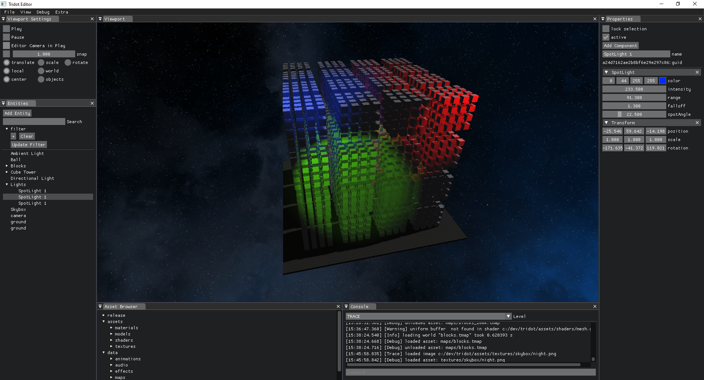

# Tridot Game Engine

- A custom 3D game engine utilizing C++, OpenGL, OpenAL, and Bullet Physics.
- Physically based rendering for realistic and dynamic lighting and materials.
- Data oriented Entity Component System
- Modular software design principles to ensure flexibility and scalability of the game engine.
- Multiplayer technology to support seamless and robust online gaming experiences.

## Screenshots

- Physics

- Entity Component System

- Lights

- Multiplayer

